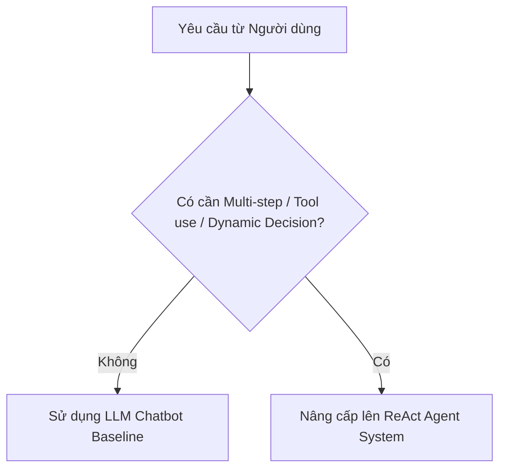
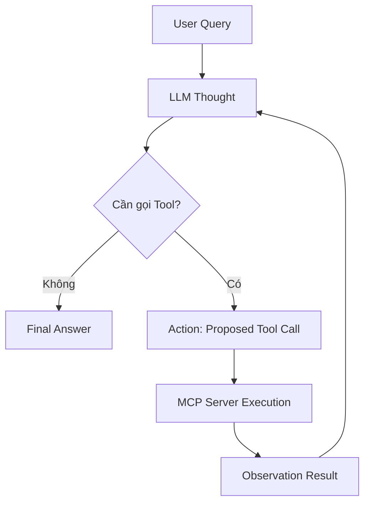

============================================================
FILE: repo/docs/CODELAB.md
============================================================
---
title: "BÀI LAB 3: CHATBOT VS REACT AGENT — TỪ LÝ THUYẾT ĐẾN THỰC THI (MCP ENHANCED)"
description: "Bài thực hành giúp học viên chuyển đổi tư duy từ viết Chatbot đơn thuần sang phát triển hệ thống ReAct Agent thông minh, ứng dụng giao thức Model Context Protocol (MCP) và trích xuất bằng chứng Waterfall Trace Log."
day: "D03"
workMode: "individual"
requiresSubmission: true
---

# 🎓 BÀI LAB 3: CHATBOT VS REACT AGENT — TỪ LÝ THUYẾT ĐẾN THỰC THI (MCP ENHANCED)

Bài thực hành giúp học viên chuyển đổi tư duy từ viết Chatbot đơn thuần sang phát triển hệ thống **ReAct Agent** thông minh, ứng dụng giao thức **Model Context Protocol (MCP)** để kết nối dữ liệu và công cụ thực tế.

> 💡 **Mục tiêu đầu ra của Bài Lab:**  
> Sau khi hoàn thành bài Lab 180 phút, học viên sẽ nộp một sản phẩm cá nhân hoàn chỉnh: mã nguồn Agent chạy mượt mà ReAct Loop & Native Tool Calling, kết nối MCP Server và trích xuất file Waterfall Trace Log chuẩn hóa.

📦 **Starter Repositories Bài Lab 3 (Fork về làm bài):**  
- ☀️ **Lớp Sáng (K4A):** [VinUni-AI20k/K4A-Day03-Lab-Chatbot-vs-ReAct-Agent-MCP](https://github.com/VinUni-AI20k/K4A-Day03-Lab-Chatbot-vs-ReAct-Agent-MCP)  
- 🌙 **Lớp Chiều (K4B):** [VinUni-AI20k/K4B-Day03-Lab-Chatbot-vs-ReAct-Agent-MCP](https://github.com/VinUni-AI20k/K4B-Day03-Lab-Chatbot-vs-ReAct-Agent-MCP)  

---

## 📋 THÔNG TIN BRIEF & BỐI CẢNH LÝ THUYẾT

- **Mục tiêu:** Xây dựng ReAct Agent kết nối MCP Server, thực thi vòng lặp suy luận Thought -> Action -> Observation và xuất vết Waterfall Trace Log.
- **Người học / Day / Thời lượng:** Học viên Khóa 4 / Ngày 03 / 180 phút làm bài (Buổi học 240 phút - 4 tiếng).
- **Link nguồn Starter Repos:**  
  * Lớp Sáng (K4A): `https://github.com/VinUni-AI20k/K4A-Day03-Lab-Chatbot-vs-ReAct-Agent-MCP`  
  * Lớp Chiều (K4B): `https://github.com/VinUni-AI20k/K4B-Day03-Lab-Chatbot-vs-ReAct-Agent-MCP`  
- **Hình thức:** Cá nhân làm bài 100% (`workMode: "individual"`).
- **Deliverable và cách kiểm tra:** Fork repo đúng ca học về GitHub cá nhân (Lớp Sáng: `K4A-DAY03-HoVaTen-MSSV` | Lớp Chiều: `K4B-DAY03-HoVaTen-MSSV`). Kiểm tra qua file log `docs/trace_waterfall.json` và mã nguồn Python `src/`.

### 💡 Khung Nền tảng Lý thuyết (4 Cấp độ AI System)
Nội dung bài Lab bám sát 100% Khung lý thuyết trong **Slide Day 3 (`day03-tu-chatbot-den-agentic-agent-react.pdf`)**:

| Cấp độ | Loại hệ thống | Đặc điểm kỹ thuật cốt lõi | Sự xuất hiện trong Bài Lab |
| :---: | :--- | :--- | :--- |
| **Cấp 1** | **Rule-Based Bot** | Khớp từ khóa `if/else` cố định, không có LLM | `src/ai_levels/level1_rule_based.py` |
| **Cấp 2** | **LLM Chatbot** | Dùng LLM sinh text mượt, không gọi được Tool | **Chatbot Baseline** (`run_baseline_chatbot`) |
| **Cấp 3** | **ReAct Agent (MCP-Enhanced)** | Vòng lặp ReAct `Thought -> Action -> Observation` | **ReAct Agent** (Trọng tâm Bài Lab) |
| **Cấp 4** | **Autonomous Agent** | Tự rã mục tiêu (Planning), tự học & có Memory | 🎁 **Phần Mở rộng Tham khảo** |

---

## 1. CHUẨN BỊ MÔI TRƯỜNG & FORK REPO (ĐA NỀN TẢNG)

Mỗi học viên tự làm việc trên môi trường máy tính của mình. Thực hiện theo đúng thứ tự các bước:

### Bước 1: Fork và Clone Repo
1. Mở trang Starter Repo GitHub và nhấn nút **Fork** về tài khoản cá nhân.
2. Đổi tên Repository theo chuẩn:
   📌 **`K4-DAY03-HoVaTen-MSSV`** *(Ví dụ: `K4-DAY03-NguyenVanA-SV2026001`)*
3. Clone Repo vừa fork về máy tính và mở bằng VSCode / IDE:
   ```bash
   git clone https://github.com/<tai_khoan_cua_ban>/K4-DAY03-HoVaTen-MSSV.git
   ```

### Bước 2: Tạo Môi trường ảo (Virtualenv) & Cài đặt Thư viện

> 🐍 **Yêu cầu môi trường Python:** **Python 3.10 – 3.12** *(Tránh Python 3.9 do thiếu type hinting hiện đại và Python 3.13 do nhiều thư viện AI chưa hỗ trợ pre-built wheel)*.

**Trên macOS / Linux / Bash / Zsh:**
```bash
python3 -m venv .venv
source .venv/bin/activate
pip install -r requirements.txt
cp .env.example .env
cp config/test_cases.example.json config/test_cases.json
```

**Trên Windows (PowerShell):**
```powershell
python -m venv .venv
.venv\Scripts\Activate.ps1
pip install -r requirements.txt
Copy-Item .env.example .env
Copy-Item config\test_cases.example.json config\test_cases.json
```
*(Nếu PowerShell chặn Script, chạy lệnh: `Set-ExecutionPolicy -ExecutionPolicy RemoteSigned -Scope CurrentUser`)*

**Trên Windows (Command Prompt - CMD):**
```cmd
python -m venv .venv
.venv\Scripts\activate.bat
pip install -r requirements.txt
copy .env.example .env
copy config\test_cases.example.json config\test_cases.json
```

- [x] Đã Fork thành công Repo về GitHub cá nhân với tiền tố `K4-DAY03-`.
- [x] Đã kích hoạt môi trường ảo `(.venv)` và cài đặt thành công thư viện từ `requirements.txt`.
- [x] Đã tạo file `config/test_cases.json` từ `config/test_cases.example.json`.

---

## 2. TASK 1.1 — ĐÁNH GIÁ 4 TIÊU CHÍ AGENTIC FIT

### Vì sao cần đánh giá Agentic Fit trước khi viết Code?
Không phải mọi bài toán đều cần đến Agent. Nếu một yêu cầu chỉ là tra cứu FAQ cố định hoặc viết lại văn bản, việc sử dụng Agent sẽ làm tăng thời gian phản hồi và chi phí token không cần thiết. Khung đánh giá Agentic Fit giúp bạn chọn đúng công nghệ phù hợp với bài toán.



### Thao tác thực hành:
1. Tham khảo danh sách đề tài gợi ý theo Lĩnh vực (Giáo dục, Nhân sự, QC/Kho vận, Y tế/Khách hàng) hoặc tự do sáng tạo **Đề tài Mở (Open Choice)** tại tệp [`DANH_SACH_DE_TAI.md`](DANH_SACH_DE_TAI.md).
2. Mở file báo cáo nộp bài duy nhất [`trace_eval.md`](trace_eval.md) điền bảng chấm điểm **Agentic Fit Scoring Matrix** (chấm điểm từ 1 đến 5 cho 4 tiêu chí: *Multi-step Reasoning, Tool Interaction, Dynamic Decision, Long Horizon Goal*).
3. Mở tệp `config/test_cases.json` hoàn thiện các câu hỏi thử nghiệm `TC03`, `TC04`, `TC05` phù hợp với chủ đề đã chọn.

### 🚩 CHECKPOINT 1 (Mốc phút 30)
- **Tín hiệu hoàn thành (Pass Signal):** Bảng Scoring Matrix trong [`trace_eval.md`](trace_eval.md) được điền đầy đủ điểm và giải trình. File `config/test_cases.json` không còn dòng `TODO`.
- **Nếu bạn bị chậm:** Chọn ngay Chủ đề 1.1 (Trợ lý Học vụ Sinh viên VinUni) có sẵn và điền nhanh điểm số để chuyển tiếp ngay sang Task 1.2.

---

## 3. TASK 1.2 — KHAI BÁO TOOL SCHEMAS CHUẨN JSON SCHEMA

### Thiết kế công cụ cho LLM:
Mô hình LLM hiểu công cụ thông qua định dạng cấu trúc JSON Schema. Một Tool Schema chuẩn phải mô tả rõ tên công cụ (`name`), mục đích sử dụng (`description`) và các kiểu dữ liệu của tham số đầu vào (`parameters`).

### Thao tác thực hành:
1. Mở tệp `src/tools.py`. Quan sát công cụ mẫu `academic_query` đã được định nghĩa sẵn.
2. Tìm mốc `# TODO 1.2` và hoàn thiện khai báo JSON Schema cho công cụ:
   - `schedule_appointment`: Công cụ đặt lịch hẹn (cần tham số `student_id`, `datetime_str`, `advisor_name`).

**Cấu trúc Tool Schema mẫu tham khảo:**
```json
{
  "name": "academic_query",
  "description": "Tra cứu hồ sơ và thông tin học vụ của sinh viên VinUni bằng mã sinh viên.",
  "parameters": {
    "type": "object",
    "properties": {
      "student_id": {
        "type": "string",
        "description": "Mã sinh viên cần tra cứu (ví dụ: 'SV2026001')"
      }
    },
    "required": ["student_id"]
  }
}
```

- [x] Đã hoàn thiện khai báo đầy đủ các Tool Schemas trong danh sách `TOOLS_SCHEMA` tại `src/tools.py`.

---

## 4. TASK 2.1 — KẾT NỐI & KIỂM TRA MCP SERVER

### Giao thức Model Context Protocol (MCP):
MCP là tiêu chuẩn mở kết nối giữa Agentic Systems và các nguồn dữ liệu/công cụ bên ngoài. Trong kiến trúc này, công cụ không nằm trong LLM mà được phục vụ độc lập từ MCP Server (`src/mcp_server.py`).

### Thao tác thực hành:
1. Mở tệp `src/mcp_server.py` kiểm tra lớp `MCPAcademicServer`.
2. Tìm mốc `# TODO 2.1` và hoàn thiện hàm `call_tool(self, tool_name, arguments)` nhận yêu cầu, gọi `dispatch_tool_call()` và đóng gói kết quả phản hồi chuẩn JSON-RPC 2.0.
3. Mở terminal và chạy lệnh kiểm tra MCP Server:
   ```bash
   python src/mcp_server.py
   ```

### 🚩 CHECKPOINT 2 (Mốc phút 70)
- **Tín hiệu hoàn thành (Pass Signal):** Terminal in ra thông báo:
  ```text
  ✅ [MCP SERVER] Đã khởi tạo thành công vinuni-academic-mcp-server (Version: 2026.1.0)
  📦 Số lượng Tools công bố qua MCP: 2
  ```
- **Nếu bạn bị chậm:** Kiểm tra lại lỗi cú pháp trong `src/tools.py`. Nếu gặp `SyntaxError`, đối chiếu với Tool Schema mẫu `academic_query` để sửa các dấu ngoặc nhọn `{}`.

---

## 5. TASK 2.2 — LẬP TRÌNH REACT LOOP VÀ NATIVE TOOL CALLING (`src/app.py`)

### Cơ chế ReAct Loop (Thought -> Action -> Observation):
Khác với Chatbot truyền thống chỉ trả về văn bản, ReAct Agent liên tục suy nghĩ (Thought), đề xuất gọi Tool (Action), nhận kết quả từ MCP Server (Observation) và đưa ra câu trả lời cuối cùng.



### Thao tác thực hành:
1. Mở tệp `src/app.py` tìm hàm `run_react_agent()`.
2. Quan sát cấu trúc vòng lặp `while step < MAX_ITERATIONS:` xử lý 2 trường hợp:
   - Khi LLM trả về `type == "text"`: In kết luận và dừng vòng lặp.
   - Khi LLM trả về `type == "tool_call"`: Gọi MCP Server thực thi và nạp kết quả Observation cho lượt kế tiếp.

---

## 6. TASK 3.1 — CHẠY TEST SUITE & TRÍCH XUẤT WATERFALL TRACE LOG

### Quan sát hệ thống qua Waterfall Trace Log:
Quan sát là yếu tố sống còn trong quản trị Agentic Systems. Bài Lab tự động trích xuất file log `docs/trace_waterfall.json` thể hiện độ trễ (latency_ms) và cây thực thi từng bước.

### Thao tác thực hành:
1. **Cấu hình API Key thật:** Mở tệp `.env` và điền `GEMINI_API_KEY` (hoặc `OPENAI_API_KEY`) của bạn để chuyển Agent từ chế độ `MockOfflineProvider` sang kết nối với LLM thật. *(⚠️ Bài nộp bắt buộc phải kết nối LLM API thật để tính điểm nghiệm thực tế).*
2. Mở terminal và thực thi bài lab qua các chế độ kiểm thử linh hoạt:
   - **Chạy toàn bộ 5 Test Cases nghiệm thu:**
     ```bash
     python src/app.py --all
     ```
   - **Trò chuyện đàm thoại trực tiếp (Interactive Chat CLI):**
     ```bash
     python src/app.py --interactive
     ```
     *(Gõ thử các câu prompt tra cứu và đặt lịch. Gõ `exit` hoặc `quit` để thoát phiên chat).*
3. Mở file `docs/trace_waterfall.json` kiểm tra cấu trúc log.
4. Mở file báo cáo nộp bài duy nhất [`trace_eval.md`](trace_eval.md), dán 1 đoạn trích xuất trace log và điền tổng kết bài kiểm thử vào Mục 2 & Mục 3.

- [x] File log `docs/trace_waterfall.json` được tạo thành công với đầy đủ các bước thực thi từ LLM API thật.
- [x] Đã thử nghiệm thành công chế độ đàm thoại trực tiếp `python src/app.py --interactive`.
- [x] Đã hoàn thiện toàn bộ biên bản kiểm thử trong `trace_eval.md`.

---

## 7. TASK 3.2 — ĐÓNG GÓI REPO CÁ NHÂN & NỘP BÀI LMS

### Thao tác nộp bài cá nhân:
1. Kiểm tra lại `git status` đảm bảo không sót file mã nguồn nào chưa lưu.
2. Thực hiện Commit và Push lên GitHub cá nhân:
   ```bash
   git add .
   git commit -m "feat: complete Day 03 Lab Chatbot vs ReAct Agent"
   git push origin main
   ```
3. Truy cập vào Repository trên GitHub cá nhân, kiểm tra cây thư mục đảm bảo có đủ các file trong `src/`, `config/test_cases.json`, `docs/trace_waterfall.json` và `docs/trace_eval.md`.

### 🚩 CHECKPOINT 3 (Mốc phút 180 - NỘP BÀI)
- **Tín hiệu hoàn thành (Pass Signal):** Link GitHub Repository `https://github.com/<tai_khoan>/K4-DAY03-HoVaTen-MSSV` đã được sao chép và dán vào ô nộp bài trên LMS VLearn.
- **Nếu bạn bị chậm:** Dù chưa hoàn thiện trọn vẹn 100% tính năng nâng cao, hãy commit và push những gì đã hoàn thành lên GitHub đúng hạn để lấy điểm tiến độ!

> ✅ **Hướng dẫn Nộp bài VLearn:**  
> Học viên dán URL Repository GitHub cá nhân vào ô nộp bài trên hệ thống LMS VLearn để hoàn tất buổi học.

---

## 8. 🚨 TRẠM CỨU HỘ SỰ CỐ & FAQS

### Các lỗi thường gặp và cách khắc phục nhanh:
- **Lỗi 1: `ModuleNotFoundError: No module named 'dotenv'`**  
  -> Môi trường ảo chưa được kích hoạt hoặc chưa chạy lệnh `pip install -r requirements.txt`. Chạy lại Bước 2 ở Phần 1.
- **Lỗi 2: Terminal Windows báo lỗi `ExecutionPolicy` khi kích hoạt `.venv`**  
  -> Chạy lệnh: `Set-ExecutionPolicy -ExecutionPolicy RemoteSigned -Scope CurrentUser` trong PowerShell rồi thử lại.
- **Lỗi 3: Không xuất hiện file `docs/trace_waterfall.json` sau khi chạy `app.py`**  
  -> Đảm bảo bạn đang đứng ở thư mục gốc của dự án khi gõ lệnh `python src/app.py`.

---

## 💯 9. THANG ĐIỂM ĐÁNH GIÁ (SCORING RUBRIC 100%)

| Tiêu chí | Trọng số | Mô tả chi tiết | Bằng chứng kiểm tra (Artifacts) |
| :--- | :---: | :--- | :--- |
| **1. Agentic Fit & Tool Specs** | **25%** | Phân tích đúng 4 tiêu chí Agentic Fit. Khai báo Tool Schema chuẩn JSON Schema. | Bảng Scoring Matrix (`docs/trace_eval.md`) + `config/test_cases.json`. |
| **2. ReAct Loop & MCP Integration** | **35%** | Vòng lặp ReAct chạy mượt mà qua Native Tool Calling & MCP Server **trên LLM API thật (Gemini/OpenAI)**. | Code trong `src/mcp_server.py` + `src/tools.py` + `src/app.py` + Log API thật. |
| **3. Waterfall Trace & Observation** | **25%** | File log `trace_waterfall.json` trích xuất đầy đủ các bước Thought $\rightarrow$ Action $\rightarrow$ Observation $\rightarrow$ Final Answer. | File log `docs/trace_waterfall.json` + `docs/trace_eval.md`. |
| **4. Git Repository & Submission** | **15%** | Cấu trúc Repo sạch sẽ, commit chuẩn chỉ và nộp đúng hạn trên LMS VLearn. | Link Repo GitHub cá nhân. |


============================================================
FILE: repo/docs/DANH_SACH_DE_TAI.md
============================================================
# 💡 DANH SÁCH GỢI Ý ĐỀ TÀI THEO LĨNH VỰC CHO BÀI LAB 3 (BƯỚC 2)

Học viên có thể chọn **1 đề tài gợi ý** theo các lĩnh vực dưới đây, hoặc **hoàn toàn tự do đề xuất chủ đề mới (Open Choice)** bám sát bài toán công việc thực tế của mình:

---

### 🎓 1. Lĩnh vực Giáo dục & Đào tạo (Education & Academics)
* **Gợi ý 1.1:** *Trợ lý Học vụ & Tra cứu Lịch thi VinUni:* Tra cứu điểm GPA, lịch thi và đặt lịch tư vấn học vụ với Cố vấn.
* **Gợi ý 1.2:** *Trợ lý Quản lý Thư viện & Tài liệu:* Tra cứu vị trí sách, tình trạng mượn/trả và gia hạn tài liệu.

### 🏢 2. Lĩnh vực Quản trị Nhân sự & Vận hành Nội bộ (HR & Operations)
* **Gợi ý 2.1:** *Trợ lý Nhân sự VinFast (HR Assistant):* Tra cứu ngày phép còn lại, chính sách bảo hiểm và tạo đơn xin nghỉ phép.
* **Gợi ý 2.2:** *Trợ lý Hỗ trợ Kỹ thuật IT Helpdesk:* Tra cứu ticket sự cố mạng, tài khoản và tạo yêu cầu hỗ trợ kỹ thuật.
* **Gợi ý 2.3:** *Trợ lý Đặt Phòng họp & Thiết bị (Facilities Agent):* Kiểm tra lịch phòng trống, thiết bị và tạo booking phòng họp.

### 🏭 3. Lĩnh vực Sản xuất & Chuỗi cung ứng (Manufacturing & Supply Chain)
* **Gợi ý 3.1:** *Trợ lý Kiểm định Chất lượng (QC Assistant):* Tra cứu ca lỗi gán nhãn 2D/3D và tạo phiếu Rework kiểm định.
* **Gợi ý 3.2:** *Trợ lý Đơn hàng & Kho vận (Supply Chain Agent):* Tra cứu mã vận đơn, vị trí lưu kho và cập nhật trạng thái đơn hàng.

### 🏥 4. Lĩnh vực Dịch vụ Khách hàng & Y tế (Customer Service & Healthcare)
* **Gợi ý 4.1:** *Trợ lý Tuyển dụng & Sàng lọc CV:* Tra cứu tiêu chí tuyển dụng vị trí và gửi thông báo lịch phỏng vấn.
* **Gợi ý 4.2:** *Trợ lý Dịch vụ Khách hàng VinBus:* Tra cứu lộ trình tuyến xe bus điện và đăng ký vé tháng.
* **Gợi ý 4.3:** *Trợ lý Tư vấn Sức khỏe Vinmec:* Tra cứu lịch làm việc bác sĩ chuyên khoa và đặt lịch khám bệnh.

---

### ⭐ 5. LĨNH VỰC MỞ — ĐỀ TÀI TỰ CHỌN (OPEN CHOICE)
> 💡 **Tự do sáng tạo:** Học viên hoàn toàn có thể chọn một bài toán thực tế bất kỳ trong công việc/cuộc sống của mình (ví dụ: *Trợ lý đặt lịch tập Gym, Trợ lý quản lý chi tiêu cá nhân, Trợ lý tư vấn mua bất động sản...*).  
> **Yêu cầu duy nhất:** Bài toán tự chọn chỉ cần đáp ứng 2 công cụ (1 công cụ tra cứu thông tin + 1 công cụ hành động/đặt lịch/cập nhật).

---

> [!TIP]
> **BƯỚC TIẾP THEO:** Sau khi lựa chọn xong chủ đề bài toán, học viên mở file tài liệu tiếp theo:  
> 👉 **[Chuyển sang Bước 3: Đánh giá Agentic Fit Scoring Matrix (trace_eval.md)](trace_eval.md)**


============================================================
FILE: repo/docs/SO_TAY_THUC_HANH.md
============================================================
# 📋 SỔ TAY THỰC HÀNH CÁ NHÂN & CHECKLIST TIẾN ĐỘ

---

## 🎯 HÌNH THỨC THỰC HIỆN: CÁ NHÂN

Bài thực hành thiết kế dành cho cá nhân học viên làm chủ quy trình phát triển Tác tử AI (AI Agent):
- Mỗi học viên tự Fork Repo về GitHub cá nhân.
- Tự hoàn thiện mã nguồn, tự đẩy bài nộp lên LMS VLearn.

---

## ⏱️ LỘ TRÌNH THỰC HÀNH (180 PHÚT LÀM BÀI)

```mermaid
gantt
    title TIẾN TRÌNH THỰC HÀNH 180 PHÚT
    dateFormat  m
    axisFormat %M m
    
    Phần 1: Agentic Fit & Tool Schemas       :m1, 0, 45m
    Phần 2: ReAct Loop & MCP Server          :m2, after m1, 60m
    Phần 3: Test Execution & Trace Log       :m3, after m2, 45m
    Phần 4: Self-Audit & Push GitHub Nộp bài :m4, after m3, 30m
```



---

## 📝 CHECKLIST CÁ NHÂN THEO TỪNG MỐC THỜI GIAN

### 🔷 PHẦN 1 (45 phút): Đánh giá Agentic Fit & Tool Schemas
* [ ] Chọn 1 chủ đề thực tế từ tệp `docs/DANH_SACH_DE_TAI.md`.
* [ ] Điền bảng Scoring Matrix 4 tiêu chí Agentic Fit vào file `docs/trace_eval.md`.
* [ ] Khai báo Tool Schema đúng chuẩn JSON Schema cho `schedule_appointment` vào file `src/tools.py`.
* [ ] Thêm 5 câu test case thực tế vào file `config/test_cases.json`.

---

### 🔷 PHẦN 2 (60 phút): ReAct Agent & MCP Server
* [ ] Hoàn thiện hàm thực thi gọi Tool theo chuẩn giao thức MCP trong `src/mcp_server.py`.
* [ ] Chạy lệnh `python src/mcp_server.py` xác nhận khởi tạo thành công MCP Server.
* [ ] Lắp ráp vòng lặp ReAct Native Tool Calling trong `src/app.py`.

---

### 🔷 PHẦN 3 (45 phút): Chạy Kiểm thử & Xuất Trace Waterfall Log
* [ ] Điền API Key thật vào file `.env`.
* [ ] Chạy lệnh `python src/app.py --all` cho 5 test cases.
* [ ] Kiểm tra file vết `docs/trace_waterfall.json` xuất ra đầy đủ độ trễ (latency_ms) và chi tiết các bước.
* [ ] Dán đoạn Trace log tóm tắt vào file `docs/trace_eval.md`.

---

### 🔷 PHẦN 4 (30 phút): Tự kiểm tra & Nộp bài Git/GitHub
* [ ] Kiểm tra tên Repo cá nhân đúng chuẩn: **`K4-DAY03-<HoVaTen>_<MSSV>`**.
* [ ] Chạy lệnh Git để push toàn bộ mã nguồn lên GitHub cá nhân:
  ```bash
  git add .
  git commit -m "feat: complete Day 03 Lab Chatbot vs ReAct Agent"
  git push origin main
  ```
* [ ] Nộp link Repo GitHub cá nhân lên hệ thống VLearn.

---

> [!NOTE]
> **HOÀN THÀNH QUY TRÌNH:** Học viên đã xem xong Sổ tay thực hành. Để quay lại Trang chủ xem lại tổng quan bài học:  
> 👉 **[Quay lại Bước 1: Trang chủ README.md](../README.md)**


============================================================
FILE: repo/docs/trace_eval.md
============================================================
# 📊 BÁO CÁO THU HOẠCH NGHIỆM THU BÀI LAB 3 (BƯỚC 3 — SUBMISSION ARTIFACT)

> **Họ và Tên Học viên:** [Điền Họ và Tên]  
> **Mã Sinh Viên / Mã Học viên:** [Điền MSSV]  
> **Chủ đề Lựa chọn:** [Điền tên chủ đề đã chọn từ docs/DANH_SACH_DE_TAI.md hoặc Đề tài Mở]  

---

## 1. BẢNG CHẤM ĐIỂM AGENTIC FIT SCORING MATRIX (ĐÁNH GIÁ CHỦ ĐỀ)

| Tiêu chí Đánh giá | Mức độ (1 - 5) | Giải trình chi tiết lý do chọn điểm |
| :--- | :---: | :--- |
| **1. Multi-step Reasoning** | / 5 | Bài toán có yêu cầu chia nhỏ nhiều bước suy luận nối tiếp nhau không? |
| **2. Tool Interaction** | / 5 | Hệ thống có cần kết nối với MCP Server / Cơ sở dữ liệu bên ngoài không? |
| **3. Dynamic Decision** | / 5 | Bước tiếp theo có phụ thuộc vào kết quả quan sát bước trước không? |
| **4. Long Horizon Goal** | / 5 | Hệ thống có phải giữ mục tiêu xuyên suốt qua nhiều lượt xử lý không? |
| **TỔNG ĐIỂM AGENTIC FIT** | **/ 20** | *Nếu tổng điểm > 12/20: Bài toán rất phù hợp triển khai Agentic System.* |

---

## 2. TRÍCH XUẤT KẾT QUẢ WATERFALL TRACE LOG (SAU KHI CHẠY TEST SUITE TRÊN API THẬT)

> ⚠️ **YÊU CẦU NGHIỆM THU:** Mở tệp `.env` điền `GEMINI_API_KEY` (hoặc `OPENAI_API_KEY`) để kết nối LLM thật trước khi thực thi `python src/app.py --all`. Bài nộp chỉ dùng Mock Offline Provider sẽ không đạt điểm nghiệm thực tế.

Dán 1 đoạn trích xuất log tiêu biểu từ file `docs/trace_waterfall.json` sinh ra từ phản hồi LLM API thật:

```json
[
  {
    "step": 1,
    "action_type": "TOOL_EXECUTION",
    "tool_name": "academic_query",
    "arguments": {
      "student_id": "SV2026001"
    },
    "observation": {
      "status": "SUCCESS",
      "student_id": "SV2026001",
      "data": {
        "full_name": "Nguyễn Văn An",
        "gpa": 3.85
      }
    },
    "latency_ms": 120.5
  }
]
```

---

## 3. TỔNG KẾT KẾT QUẢ NGHIỆM THU & NỘP BÀI

- [ ] Đã điền API Key thật trong `.env` và xác nhận Agent chạy mượt mà trên LLM API thật (Gemini/OpenAI).
- **Tổng số Test Cases đã chạy thành công:** ___ / 5 test cases.
- **Số lượt gọi Tool qua MCP Server chính xác:** ___ lượt.
- **Kết quả đẩy Repo nộp bài:** [ ] Đã Commit và Push mã nguồn thành công lên GitHub cá nhân.

---

> ✅ **HOÀN TẤT NỘP BÀI:** Sao chép đường link GitHub Repository cá nhân của bạn và dán vào ô nộp bài trên hệ thống LMS VLearn để hoàn tất Bài Lab 3!


============================================================
FILE: repo/README.md
============================================================
# 🏫 BÀI LAB 3: CHATBOT VS REACT AGENT — TỪ LÝ THUYẾT ĐẾN THỰC THI (MCP ENHANCED)

> **Mã bài học:** `DAY03-REACT-AGENT`  
> **Hình thức thực hiện:** **CÁ NHÂN** *(Mỗi học viên tự làm và tự nộp 1 bài cá nhân)*  
> **Quy chuẩn nộp bài:** Học viên Fork Repo này về GitHub cá nhân và đổi tên theo đúng cú pháp:  
> 📌 **`K4-DAY03-HoVaTen-MSSV`** *(Ví dụ: `K4-DAY03-NguyenVanA-SV2026001`)*  

---

## ⚡ 1. QUICKSTART — CÀI ĐẶT MÔI TRƯỜNG & CHẠY THỬ (3 PHÚT)

> 🐍 **Yêu cầu môi trường Python:** **Python 3.10 – 3.12** *(Tránh Python 3.9 do thiếu type hinting hiện đại và Python 3.13 do nhiều thư viện AI chưa hỗ trợ pre-built wheel)*.

Thực hiện 3 bước lệnh Terminal thiết thực ngay khi clone repo về máy:

### Bước 1: Clone Repo & Tạo môi trường ảo
```bash
git clone https://github.com/<tai_khoan_cua_ban>/K4-DAY03-HoVaTen-MSSV.git
cd K4-DAY03-HoVaTen-MSSV

python -m venv .venv
# Trên Windows PowerShell:
.venv\Scripts\Activate.ps1
# Trên macOS / Linux / Bash / Zsh:
source .venv/bin/activate
```

### Bước 2: Cài đặt thư viện & Tạo file cấu hình môi trường
```bash
pip install -r requirements.txt
# Trên Windows CMD/PowerShell:
copy .env.example .env
copy config\test_cases.example.json config\test_cases.json
# Trên macOS / Linux:
cp .env.example .env
cp config/test_cases.example.json config/test_cases.json
```

### Bước 3: Chạy thử Baseline kiểm tra môi trường
```bash
python src/app.py --all
```

**Kỳ vọng Output màn hình:**
```text
✅ [MOCK OFFLINE MODE PASS]: Môi trường đã sẵn sàng! 
📊 [KẾT QUẢ TEST SUITE]: 2 Đã chạy (TC01, TC02 mẫu) | 3 Đang chờ viết câu hỏi (TODO)
```

> 🔑 **QUY ĐỊNH BẮT BUỘC VỀ API KEY VÀ NỘP BÀI (SUBMISSION REQUIREMENT):**  
> 
> 1. **Giai đoạn gõ code & debug (Miễn phí 0đ):** Hệ thống mặc định chạy `MockOfflineProvider` giúp bạn thực hành gõ code, kiểm thử logic ban đầu hoàn toàn miễn phí, không tốn token, không lo nghẽn mạng.  
> 2. **Giai đoạn NỘP BÀI CHÍNH THỨC (Bắt buộc dùng LLM thật):** Khi chạy nghiệm thu để lấy dữ liệu dán vào báo cáo [`docs/trace_eval.md`](docs/trace_eval.md) nộp bài, **học viên BẮT BUỘC phải mở file `.env` điền `GEMINI_API_KEY` (hoặc `OPENAI_API_KEY`)** để Agent giao tiếp với mô hình LLM thật.  
> 
> ⚠️ *Lưu ý:* Bài nộp chỉ chạy trên Mock Provider mà không kết nối LLM API thật sẽ bị trừ điểm phần nghiệm thu thực tế (Tiêu chí 2 & Tiêu chí 3 trong Rubric).

---

## 🎯 2. BỨC TRANH TỔNG THỂ & MỤC TIÊU DÀI HẠN (NORTH STAR GOAL)

Mục tiêu cốt lõi của Bài Lab này là giúp học viên tự tay phát triển một **Trợ lý Tác tử ReAct (ReAct Agent)** hoàn chỉnh.

Thay vì chỉ sinh văn bản hội thoại đơn thuần như Chatbot cơ bản, tác tử (Agent) của bạn sẽ có khả năng:
1. **Tự suy luận và chọn công cụ:** Chủ động kích hoạt vòng lặp ReAct (`Thought -> Action -> Observation`) qua giao thức **Model Context Protocol (MCP)** để truy vấn dữ liệu thực tế.
2. **Tổng hợp câu trả lời chính xác:** Sử dụng dữ liệu thực tế từ Tool trả về để trả lời sinh viên, tránh hiện tượng ảo giác (Hallucination).
3. **Trích xuất bằng chứng (Trace Log):** Ghi lại file vết `docs/trace_waterfall.json` chứng minh chuỗi suy luận từng bước của Agent.

> 🌐 **GIAO THỨC MODEL CONTEXT PROTOCOL (MCP):**  
> Mã nguồn [`src/mcp_server.py`](src/mcp_server.py) mô phỏng kiến trúc MCP Server chuẩn (giao tiếp Client-Server độc lập qua giao thức JSON-RPC 2.0). Agent Core ([`src/app.py`](src/app.py)) đóng vai trò MCP Client gửi yêu cầu thực thi Tool tới MCP Server.

---

## 🗺️ 3. LUỒNG THỰC HÀNH TINH GIẢN 3 BƯỚC (DOCUMENTATION FLOW)

Học viên làm bài lần lượt theo đúng luồng 3 bước tinh giản dưới đây:

| Bước | Tài liệu / Hành động | Nội dung thực hiện |
| :---: | :--- | :--- |
| **Bước 1** | 📄 **`README.md`** *(Hiện tại)* | Nắm quy chế, chạy Quickstart verify môi trường offline miễn phí. |
| **Bước 2** | 🎓 **`docs/CODELAB.md`** | **[TRỌNG TÂM]** Chọn bài toán (Tham khảo gợi ý tại [docs/DANH_SACH_DE_TAI.md](docs/DANH_SACH_DE_TAI.md)) ➔ Phân tích Agentic Fit ➔ Điền `GEMINI_API_KEY` ➔ Code từng task theo checklist. |
| **Bước 3** | 📊 **`docs/trace_eval.md`** | Chạy test suite với API thật, xuất trace log, hoàn thiện báo cáo thu hoạch duy nhất và push repo nộp bài. |

---

## ⏱️ 4. PHÂN BỔ THỜI GIAN (180 PHÚT LÀM BÀI)

* **Phần 1 (45 phút):** Agentic Fit & Tool Schemas (Đánh giá 4 tiêu chí Fit & Khai báo Tool Schema chuẩn JSON Schema)
* **Phần 2 (60 phút):** ReAct Loop & MCP Integration (Viết hàm MCP Server & Vòng lặp Thought -> Action -> Observation)
* **Phần 3 (45 phút):** Test Execution & Waterfall Log (Cắm API Key thật, chạy 5 Test Cases & Xuất file docs/trace_waterfall.json)
* **Phần 4 (30 phút):** Self-Audit & Push GitHub (Tự kiểm tra code, hoàn thiện báo cáo docs/trace_eval.md & push bài nộp lên GitHub cá nhân)

---

## 📂 5. CẤU TRÚC THƯ MỤC DỰ ÁN

```text
📁 K4-Day03-Lab-Chatbot-vs-ReAct-Agent-MCP/
├── 📄 README.md                 <-- ⚡ [BƯỚC 1] Quickstart setup & Cảnh báo quy định API Key
├── 📄 .env.example              <-- 🔑 File cấu hình API Key (Gemini, OpenAI, Anthropic, Mock)
├── 📄 requirements.txt          <-- 📦 Thư viện Python tương thích đa nền tảng
│
├── 📁 config/
│   ├── 📄 test_cases.example.json <-- 🟢 Mẫu Bộ 5 Test Cases (Copy thành test_cases.json)
│   └── 📄 test_cases.json         <-- 🟢 Bộ 5 Test Cases tùy biến theo đề tài của bạn
│
├── 📁 src/                      <-- 💻 MÃ NGUỒN PYTHON
│   ├── 📄 mcp_server.py         <-- 🌐 MCP Server quản lý Tool Registry & JSON-RPC Dispatcher
│   ├── 📄 tools.py              <-- 🛠️ Backend Tool Schemas JSON & Execution Layer
│   ├── 📄 prompts.py            <-- 🛡️ System Prompts cho Chatbot và ReAct Agent
│   ├── 📄 providers.py          <-- 🔌 Multi-Provider LLM Adapter (Gemini/OpenAI/Mock)
│   ├── 📄 app.py                <-- 🚀 MCP Client & Core Agent App ghép nối ReAct Loop & Trace Log
│   └── 📁 ai_levels/            <-- 📚 [REFERENCE ONLY] Code mẫu kiến trúc tham khảo (Không sửa/debug)
│       └── 📄 README.md         <-- ⚠️ Chú thích mã nguồn tham khảo
│
└── 📁 docs/                     <-- 📚 TÀI LIỆU HƯỚNG DẪN CHUẨN VLEARN CODELAB
    ├── 📄 DANH_SACH_DE_TAI.md    <-- 💡 Gợi ý chủ đề theo Lĩnh vực & Đề tài Mở
    ├── 📄 CODELAB.md            <-- 🎓 [BƯỚC 2 - TRỌNG TÂM] Hướng dẫn Codelab thực hành theo checklist
    └── 📄 trace_eval.md          <-- 📊 [BƯỚC 3] File Báo cáo Nộp bài duy nhất (Submission Report Artifact)
```

---

## 💯 6. THANG ĐIỂM ĐÁNH GIÁ (SCORING RUBRIC 100%)

| Tiêu chí | Trọng số | Mô tả chi tiết | Bằng chứng kiểm tra (Artifacts) |
| :--- | :---: | :--- | :--- |
| **1. Agentic Fit & Tool Specs** | **25%** | Phân tích đúng 4 tiêu chí Agentic Fit. Khai báo Tool Schema chuẩn JSON Schema. | Bảng Scoring Matrix (`docs/trace_eval.md`) + `config/test_cases.json`. |
| **2. ReAct Loop & MCP Integration** | **35%** | Vòng lặp ReAct chạy mượt mà qua Native Tool Calling & MCP Server **trên LLM API thật (Gemini/OpenAI)**. | Code trong `src/mcp_server.py` + `src/tools.py` + `src/app.py` + Log API thật. |
| **3. Waterfall Trace & Observation** | **25%** | File log `trace_waterfall.json` trích xuất đầy đủ chuỗi suy luận Thought $\rightarrow$ Action $\rightarrow$ Observation. | File log `docs/trace_waterfall.json` + `docs/trace_eval.md`. |
| **4. Git Repository & Submission** | **15%** | Cấu trúc Repo sạch sẽ, commit chuẩn chỉ và nộp đúng hạn trên LMS VLearn. | Link Repo GitHub cá nhân. |


============================================================
FILE: repo/src/ai_levels/README.md
============================================================
# 📚 ARCHITECTURAL REFERENCE LEVELS [REFERENCE ONLY]

> ⚠️ **LƯU Ý QUAN TRỌNG DÀNH CHO HỌC VIÊN:**
> - Các file trong thư mục này (`ai_levels/`) **KHÔNG PHẢI LÀ BÀI TẬP** bạn cần chỉnh sửa hay debug.
> - Đây là **MÃ NGUỒN MẪU THAM KHẢO** thể hiện quá trình tiến hóa kiến trúc qua các cấp độ Agentic AI:
>   * `level3_native_mcp_agent.py`: Cấp 3 - ReAct Agent giao tiếp qua giao thức MCP (Model Context Protocol).
> - **PHẦN BÀI TẬP BẮT BUỘC CỦA BẠN NẰM Ở:**
>   1. **`src/tools.py`**: Khai báo Tool Schemas JSON (Task 1.2).
>   2. **`src/mcp_server.py`**: Hoàn thiện hàm thực thi gọi tool qua MCP Server (Task 2.1).
>   3. **`src/app.py`**: Lắp ráp ReAct Loop và trích xuất Trace Log (Task 2.2).
>   4. **`config/test_cases.json`**: Viết bộ 5 Test Cases theo đề tài bạn đã chọn (Task 1.1).


============================================================
FILE: vlearn.md
============================================================
# VLEARN LAB GUIDE

## LAB 3 - CHATBOT VS REACT AGENT

Mục tiêu: xây dựng ReAct Agent dùng Native Tool Calling, thực thi vòng lặp Thought -> Action -> Observation và tạo Waterfall Trace Log.

### Learning objectives
- Đánh giá Agentic Fit trước khi chọn kiến trúc.
- Khai báo tool schema và dispatcher.
- Thực thi multi-step ReAct loop.
- Quan sát bằng chứng trong trace và phục hồi sau lỗi.

### Reference checkpoints
- TASK 1.1: Agentic Fit Scoring Matrix.
- TASK 1.2: Tool schemas.
- TASK 2.1: Python dispatcher.
- TASK 2.2: ReAct loop.
- TASK 3.1: Waterfall trace.
- TASK 3.2: Submission report.

Lab guide là kiến thức tham khảo, không phải execution script bắt buộc. Một workflow khác vẫn hợp lệ nếu hợp lý, không vi phạm constraint và đạt learning objective.

